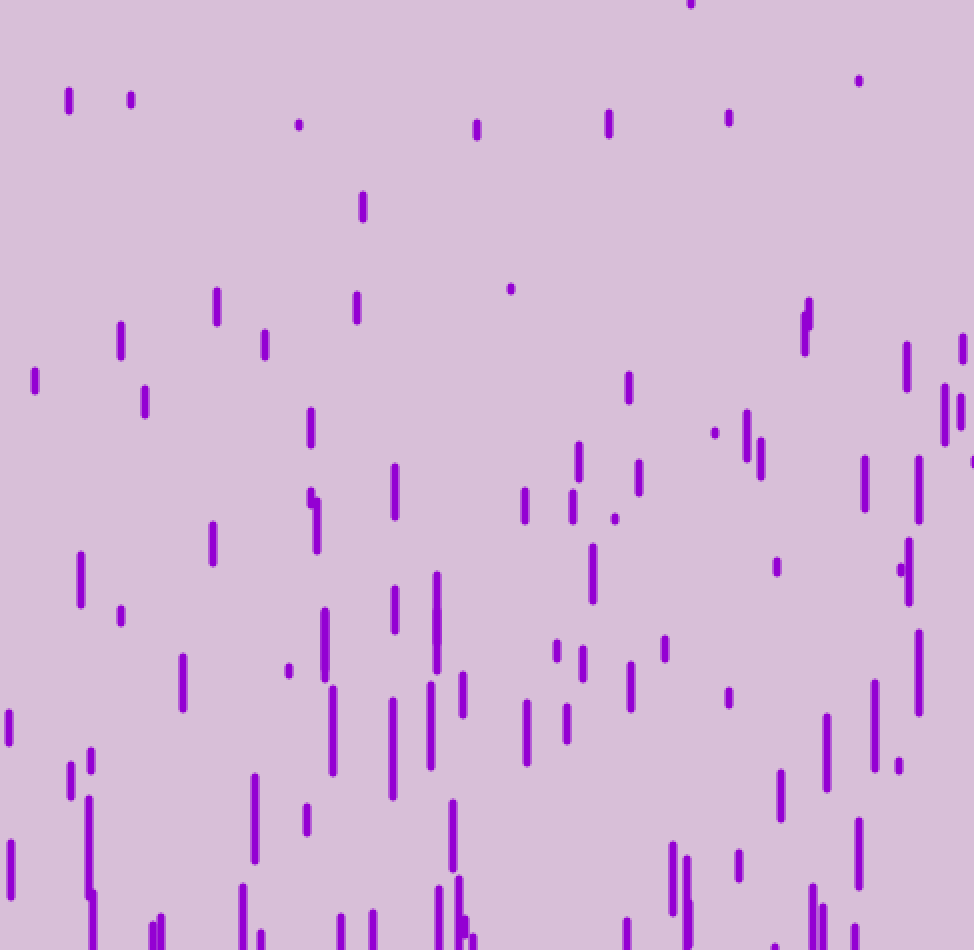

# Everything Processing 

## Content 
<ul>
	<li>Processing for beginners
		<ul>
			<li>arrays</li>
			<li>shapes</li>
			<li>background</li>
			<li>movement</li>
			<li>conditionals</li>
			<li>and much more...</li>
		</ul>
	</li>
	<li><a href="#depth">Processing in depth</a></li>
	<li><a href="#challenge">Processing challenges</a></li>
</ul>

## Processing in Depth 

Here you'll see 

<ul>
	<li>arrays list</li>
	<li>classes</li>
	<li>vectors</li>
	<li>mouse events</li>
	<li>mouse movement</li>
	<li>....</li>
</ul>

## Processing Challenges

Lets see some visuals 

<ul>
	<li>moving points</li>
	<li>Rain </li>
	<li>Starfield </li>
</ul>